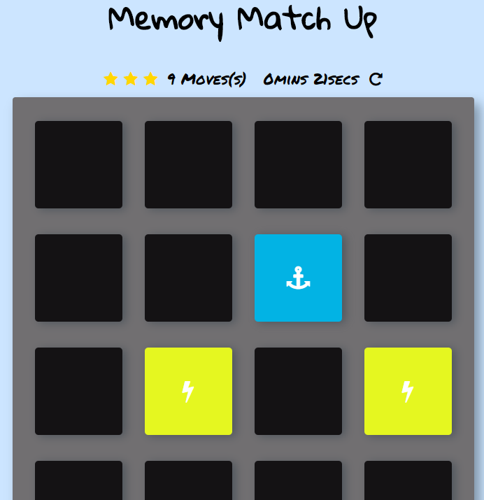

# Memory Match Up - Udacity Memory Game Project

## What is Memory Match Up

Memory Match Up is a Javascript implementation of Memory Game (http://en.wikipedia.org/wiki/Concentration_(game)), meant to test a user's memory.

## Objective
The objective is to match cards in the least time and fewest number of moves.

## Instructions

* To get started, click any card.
* Select a second card.  If the cards match, animation will occur and the color of the matching cards will go from blue to yellow.
* Continue until all cards on the board are matched.
As the move number increases, the star count will begin to decrease until it reaches one star.  With one star being the lowest possible score.
Once all cards are matched, a popup will appear with your total time and number of moves.

## How to Play
Demo is available at https://codepen.io/bond0807/pen/mxQQvW

## Bug_Tracker
Have you found a bug?  Please add comments to the Comments section on https://codepen.io/bond0807/pen/mxQQvW

## How I built Memory Match Up
I modified the DOM with JS, modified part of the HTML and added styling using CSS.
* Created an array of cards that shuffles when the game is refreshed.
*
